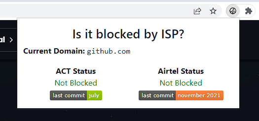

# Is the site blocked?

This repository contains the files for a Chrome extension that checks whether the website is blocked by the ISPs in India. (Specifically, ACT Fibernet and Airtel)

This project uses the repositories made available by [qurbat](https://github.com/qurbat) and [captn3m0](https://github.com/captn3m0) which contains periodically updated list of websites that are known to be blocked by the ISPs.
* ACT Fibernet by qurbat: https://github.com/qurbat/blocked-hosts
* Airtel by captn3m0: https://github.com/captn3m0/airtel-blocked-hosts

## Installation

1. Download the repository as a zip file and extract it.
2. Open Chrome and go to `chrome://extensions/`.
3. Enable `Developer mode` by clicking on the toggle switch on the top right corner.
4. Click on `Load unpacked` and select the folder containing the extracted files.

## Usage

Click on the extension icon to check whether the website is blocked or not. The extension will compare the domain with the block lists and display a message indicating whether the website is blocked or not.

This extension requires an active internet connection to work. It will only be used to fetch the block lists and no other data will be collected from the user.

## Contributing

Feel free to open an issue or submit a pull request if you find any bugs or have any suggestions.